<!-- ### 座驾麒麟

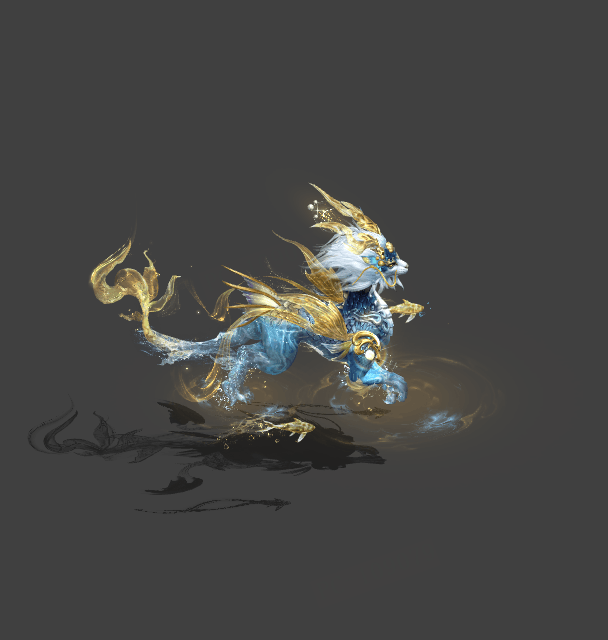

**技术方案：** 着重表现麒麟腿部与尾部的水体质感，顶点动画+采样scenecolor做折射+matcap表现反射。

### 七彩祥云座驾

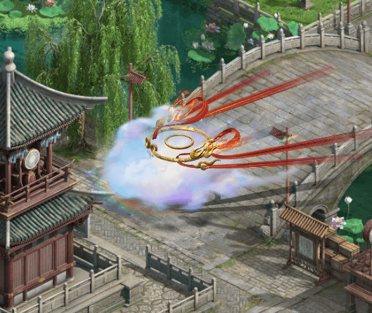

**技术方案：** 多层面片代替raymarching实现云层流动与七彩变换

### 座驾马

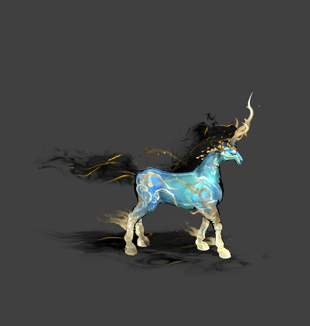

### 帝俊boss

**背景** 帝俊boss是游戏新出副本中一个非常重要的角色，设定上是撕开虚空降临的boss，背景材质需要表现虚空效果，同时身体材质也要有一定的神圣表现。

**技术方案** 运用SDF控制空间撕裂随时间的形状，同时叠加多层视差错位效果营造立体感，用写深度的透明渲染规避了stencil的使用。身体采用多层流光+3s+自定义点灯光+matcap表现

### 高清化角色

**背景** 现行版游戏常规服中，主角材质使用是纯albedo烘焙方案，所有光照信息均绘制在albedo贴图上，无动态光照效果，迫切需要进行效果上的优化，接入PBR渲染流程。重构后的基础材质主要由下面四个shader组成：布料、头发、皮肤、眼球四部分组成。主要负责布料、皮肤的材质开发工作。

**技术方案：** 布料：引入布料标志性的Sheen以及各向异性特征，摒弃耗时且效果不明显的fiber、transmition特性，引入了彩色镀膜等一些特殊效果。皮肤：着重保留皮肤3s和双层高光，3s实现方式为预积分采样，同时为了凸显体积感，边缘做了渐暗处理。两者共用一套环境光计算，并有一些简化处理。

-----------------------------------------------------------------
-----------------------------------------------------------------
----------------------------------------------------------------- -->

### 大气散射

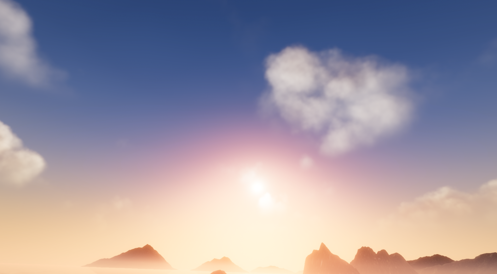

**技术方案：** 主要思想还是RayMarching，但是在性能上有一定改善。这套系统主要由三部分组成，一个是计算部分，这个部分主要由两个Compute Shader负责；另一个部分是渲染部分，这个部分也由两个Shader组成，一个负责天空盒的渲染，另一个负责屏幕空间渲染；最后一个部分就是C# Render Feature，它责参数的调整控制和渲染流程的控制。

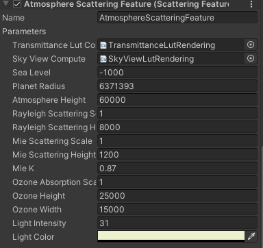

Compute Shader部分预计算了太阳光线传递到指定点的光线强度，以及人眼从各个角度观察到的天空的颜色。他们两者的计算结果分别存储在RT中分辨率为256*128。在渲染部分，天空盒渲染直接采样计算出的RT，而屏幕空间的采样除了要采样RT外，还要采样主光源阴影贴图，这个部分计算量较大。

**性能测量：** compute shader部分预计算虽然每像素有32步，但好在分辨率不高，只有256*128，性能消耗较小。 主要是采样阴影贴图形成体积光效果的部分，经过测试在1080p的分辨率下，每像素32步，阴影贴图分辨率为2K的情况下，整个性能消耗在1.2ms左右。

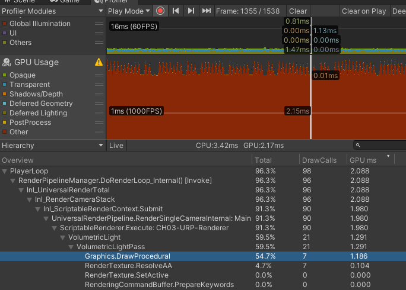

### 聚光灯体积光

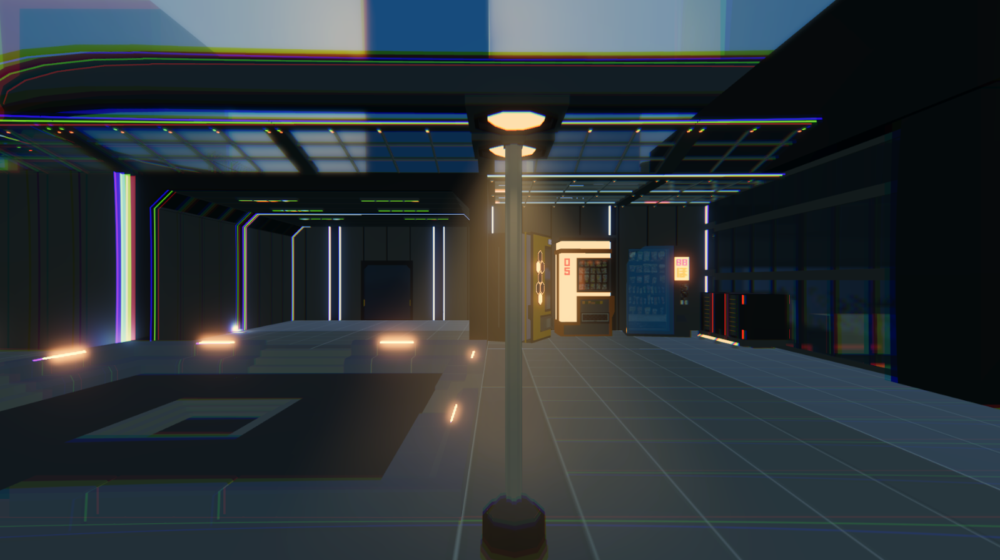

**技术方案：** 这个主要是为了解决上面大气散射中提到的体积光问题，上面主要是采样主光源的阴影贴图，因为采样的步进很长，对于这种小范围的灯光效果呈现的不是很好，所以采用在mesh上渲染的方法弥补这个缺点。主要思路是在聚光灯周围生成一圈mesh，从mesh表面向内部进行raymarching，同时在采样世界噪声，在mesh表面生成体积光效果。基本的技术比如抖动采样，高斯模糊等都有使用来优化表现效果。

**性能测量：** 因为每盏灯的采样长度较短，因此不需要很多的采样步数，并且采样的像素一般不是很多，所以性能消耗很低。在1080p的分辨率下，每像素采样10步的情况下，每盏灯的消耗极低。场景中测试50栈灯的情况下，性能消耗为0.1ms左右。

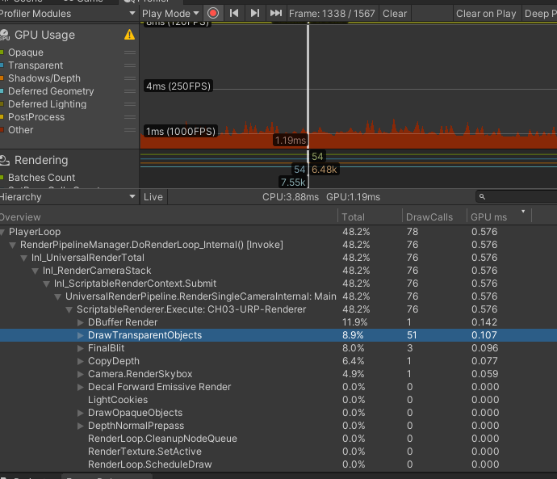

### 程序化草地

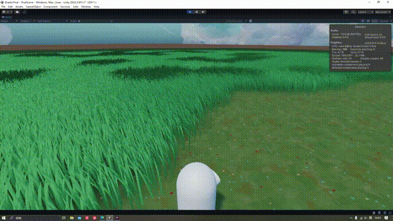

个人知乎主页有详细介绍
[点击前往](https://zhuanlan.zhihu.com/p/678303909)

### 水体渲染

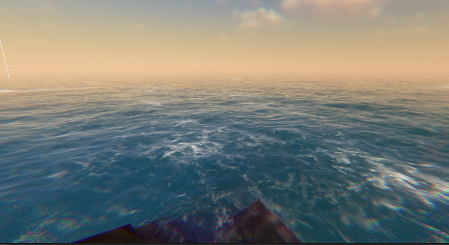

**技术方案：** C#端预先生成指定范围的mesh，并在GPU Tessellation。基于GPU的FFT算法，在Shader中初始化水面信息，并在每帧进行更新。水面反射基于当前画面的镜面图像与水面UV扭曲的叠加、折射基于当前画面除透明物体外的RT的混合叠加。光照模型blinn-phong，加入Frener反射项。浮沫由预先出入的噪声图控制，三通道分别存储浮沫在浪花高点、水平位置、海滨位置的形状，并按照一定比例实时混合。

**性能测量：** 在1080p的分辨率下，该效果的性能消耗主要为两部分，一部分是FFT网格的计算另一部分是水面的渲染，网格计算消耗大约是1.2ms、水面的渲染消耗大约是1ms左右。如果采样Flow map的方案然后限制水面大小，那么性能能控制在一个非常好的范围内。

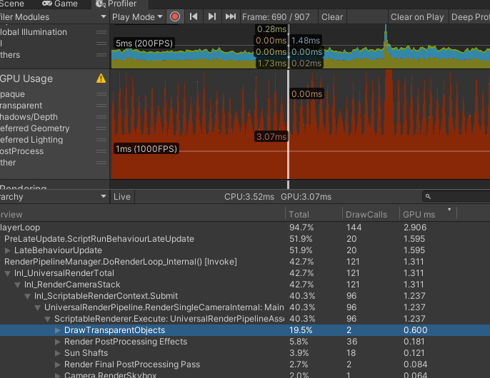

### 小工具

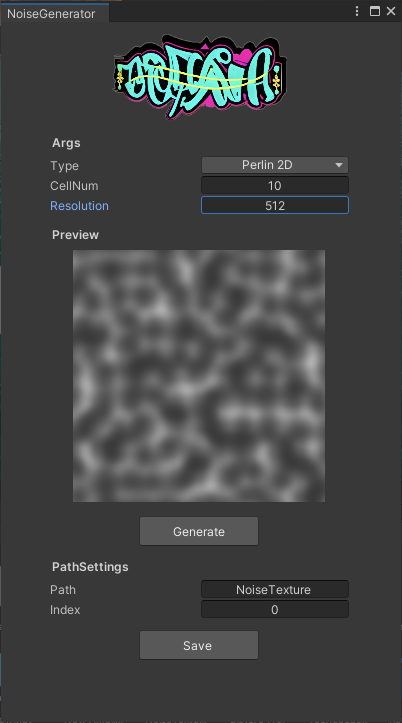

**简介：** 常用噪声生成工具，支持多种噪声类型，支持3D噪声，支持噪声的保存，使用Compute Shader生成性能良好。

### 各种效果

## Gamejam

### Untouchable
[演示视频](https://www.bilibili.com/video/BV1uW4y1f7oq/?spm_id_from=333.999.0.0&vd_source=31076ab99ae3727137c5c3925b3c8d2f)

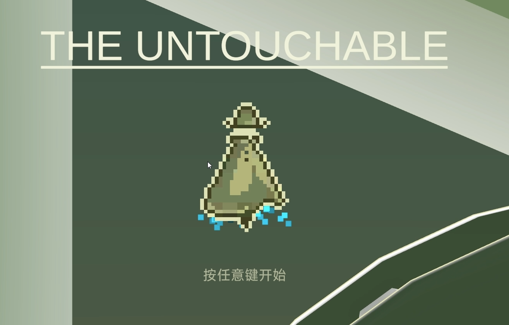

**简介：** 2023 CIGA 项目, 2D解密游戏，场景中能被操控的只有重力，玩家需要通过改变重力方向来使人物移动，并且中途蹦年碰到任何物体。场景中存在一些特殊机关，重力的改变能使发生变化，玩家需要想法设法破除机关，然后抵达终点。

**奖项：** 北京ACG站 最佳人气奖

**设计过程：**

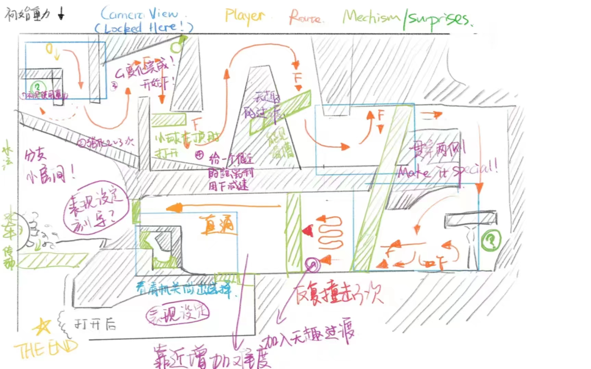
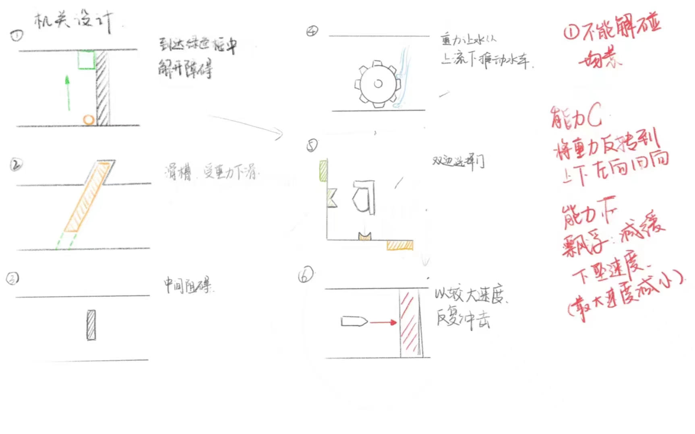

### 盐柱

[演示视频](https://www.bilibili.com/video/BV1Do4y1M7qZ/)

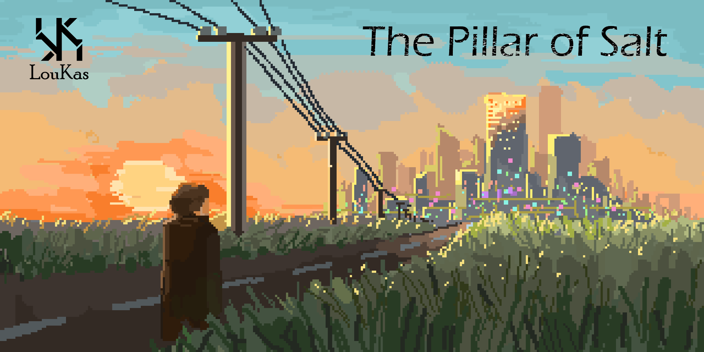

**简介：** 2023上半年游戏创作2的结课作品，一款叙事解密游戏，俯视角2D人物加3D场景，玩家需要在探索途中发现永生的真相。

**我的工作：** 对话系统和角色3C的设计与实现，部分模型的搭建和特殊Shader的编写。

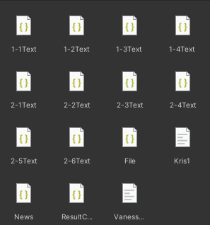

## 陶牛商旅
[演示视频](https://www.bilibili.com/video/BV1f34y1H7dU/?spm_id_from=333.999.0.0&vd_source=31076ab99ae3727137c5c3925b3c8d2f)

**简介：** 2022上半年游戏创作1的结课作品，一款2D经营游戏。玩家需要操控陶牛在各个城镇之间往返，收集素材，在城镇中制作商品并卖给有需要的人，从而赚取金钱进行更长远旅行以及制作更高级的物品制作。
