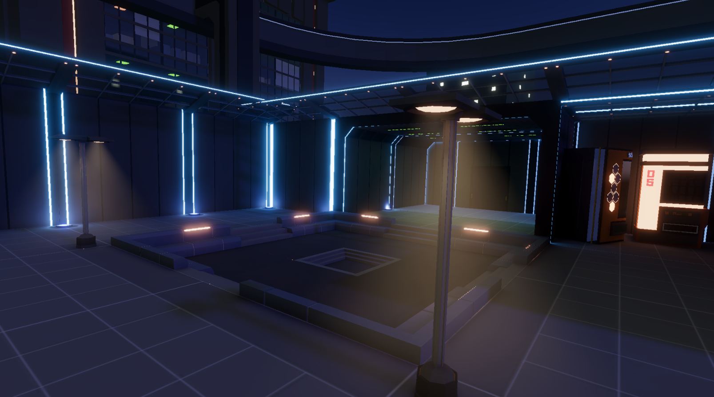

# 作品视频概览

还在剪辑中。。。

# 项目简介

## 大气散射

**概述：** 使用compute shader预计算大气衰减和散射，然后指定shader中采样这两张rt和csm，完成简单大气效果的处理。

**性能：** 使用compute shader预计算的rt分辨率不高，只有256*256，性能消耗较小。在raymarching采样中，占主要性能消耗的是csm的采样，经过测试在1080p的分辨率下，每像素32步，采样2k的csm，性能消耗在1.5ms左右。

## 聚光灯体积光

**概述：** 在聚光灯周围生成一圈mesh，从mesh表面向内部进行raymarching，同时在采样世界噪声，在mesh表面生成体积光效果。

**性能：** 在1080p的分辨率下，每盏灯的消耗极低，不到0.1ms。

## 程序化草地

知乎主页有详细介绍
[知乎](https://zhuanlan.zhihu.com/p/678303909)

## 壳层霉斑

**概述：** 运用壳层毛发技术来表现具有立体感的霉斑，通过特定mask控制霉斑生长的形状，指定层叠的层数和颜色，最终实现立体感的霉斑效果。

**性能：** 在1080p分辨率下，生成10*10大小的霉斑区域，层叠层数为40，性能消耗为1ms左右。由于每层都是transparent的，所以无法使用GPU instancing，感觉性能消耗较大，小范围使用较为合适。

# Gamejam

## Untouchable
[视频演示](https://www.bilibili.com/video/BV1uW4y1f7oq/?spm_id_from=333.999.0.0&vd_source=31076ab99ae3727137c5c3925b3c8d2f)

**简介：** 2023 CIGA 项目, 2D解密游戏，场景中能被操控的只有重力，玩家需要通过改变重力方向来使人物移动，并且中途蹦年碰到任何物体。场景中存在一些特殊机关，重力的改变能使发生变化，玩家需要想法设法破除机关，然后抵达终点。

**奖项：** 北京ACG站 最佳人气奖

**设计过程：**

## 盐柱

[视频演示](https://www.bilibili.com/video/BV1Do4y1M7qZ/)

**简介：** 2023上半年游戏创作2的结课作品，一款叙事解密游戏，俯视角2D人物加3D场景，玩家需要在探索途中发现永生的真相。

**我的工作：** 对话系统和角色3C的设计与实现，部分模型的搭建和特殊Shader的编写。

## 陶牛商旅
[视频演示](https://www.bilibili.com/video/BV1f34y1H7dU/?spm_id_from=333.999.0.0&vd_source=31076ab99ae3727137c5c3925b3c8d2f)

**简介：** 2022上半年游戏创作1的结课作品，一款2D经营游戏。玩家需要操控陶牛在各个城镇之间往返，收集素材，在城镇中制作商品并卖给有需要的人，从而赚取金钱进行更长远旅行以及制作更高级的物品制作。
